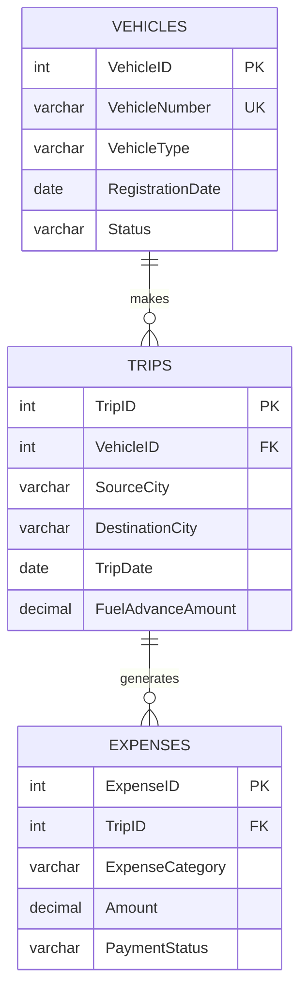

# Logistics Operations — SQL Server Database

A small T-SQL project for tracking vehicle trips and their expenses:
which trucks/vans went where, how much fuel advance they were given,
and whether the resulting expense payments went through.

Built for Microsoft SQL Server (T-SQL), tested in SSMS.

## Overview

The database models three things:

- **Vehicles** — the fleet (trucks and vans, with status)
- **Trips** — each trip a vehicle makes, source/destination city, and
  the fuel advance handed out for it
- **Expenses** — individual expense line items tied to a trip (fuel,
  toll, food, maintenance, etc), each with a payment status

On top of that there are five reporting queries, one composite index,
and a stored procedure that shows how to insert an expense safely
inside a transaction.

## Technologies Used

- Microsoft SQL Server / T-SQL
- SSMS (SQL Server Management Studio) for running and testing scripts

## Database Schema

```
Vehicles (1) ---- (many) Trips (1) ---- (many) Expenses
```

See [`docs/DatabaseDesign.md`](docs/DatabaseDesign.md) for the full
column-by-column breakdown and constraint naming convention.

## ER Diagram



A full copy also lives in [`docs/ERD.md`](docs/ERD.md).

## Folder Structure

```
Logistics-Fleet-Operations/
│
├── README.md
├── LICENSE
├── .gitignore
│
├── docs/
│   ├── Assignment.md
│   ├── DatabaseDesign.md
│   ├── ERD.md
│   └── Screenshots.md
│
├── sql/
│   ├── 01_Create_Database.sql
│   ├── 02_Create_Tables.sql
│   ├── 03_Insert_Data.sql
│   ├── 04_Queries.sql
│   ├── 05_Indexes.sql
│   ├── 06_Transactions.sql
│   ├── 07_Testing.sql
│   └── 08_Drop_Database.sql
│
├── images/
│   └── (screenshots go here — see docs/Screenshots.md)
│
└── report/
    └── (optional write-up / PDF goes here)
```

## Setup Instructions

1. Install SQL Server (Express is fine) and SSMS if you don't have them.
2. Clone or download this repo.
3. Open the `sql/` scripts in SSMS **in numeric order**, or run them
   one at a time from a query window connected to your instance.

## How to Run

```
01_Create_Database.sql   -- creates LogisticsFleetDB
02_Create_Tables.sql     -- creates Vehicles, Trips, Expenses
03_Insert_Data.sql       -- loads sample data (8 vehicles / 14 trips / 26 expenses)
04_Queries.sql           -- the 5 reporting queries
05_Indexes.sql           -- composite index on Expenses
06_Transactions.sql      -- usp_InsertExpense stored procedure
07_Testing.sql           -- quick sanity checks / row counts
08_Drop_Database.sql     -- tears everything down (optional, dev only)
```

Each file has `USE LogisticsFleetDB;` at the top, so as long as
`01_Create_Database.sql` has been run once, the rest can be re-run
independently if needed.

## Query Descriptions

1. **Regional Outbound Logistics Tracker** — trips to Delhi or Mumbai
   between Jan 2025 and Jun 2026, with vehicle number attached.
2. **Failed Payment Audit** — every expense with `PaymentStatus = 'Failed'`,
   joined back to trip and vehicle via `INNER JOIN`.
3. **Top 3 Highest Successful Expenses** — simple `TOP 3 ... ORDER BY
   Amount DESC` filtered to successful payments.
4. **Monthly MIS** — trips and successful expense totals grouped by
   `VehicleType` and month (`YYYY-MM`), using `FORMAT()`.
5. **Data Integrity Audit** — trips where the sum of successful expenses
   is greater than the fuel advance that was given out — basically a
   list of trips that ran over budget.

## Index Strategy

`IX_Expenses_Category_PaymentStatus` is a composite (non-clustered)
index on `(ExpenseCategory, PaymentStatus)`, with `Amount` and `TripID`
included.

Most of the reporting here filters on category and status *together*
("failed fuel expenses", "successful toll expenses"), so one composite
index lets SQL Server do a single seek instead of touching two separate
single-column indexes and merging the results. It also keeps insert/update
overhead lower since there's only one extra index to maintain instead of
two. `ExpenseCategory` is the lead column because it's more selective —
`PaymentStatus` only has two values, so putting it first would make for
a much less useful index on its own.

## Transaction Handling

`usp_InsertExpense` (in `06_Transactions.sql`) wraps an expense insert in
`BEGIN TRAN` / `COMMIT TRAN`, with the whole thing inside `BEGIN TRY /
BEGIN CATCH`. It validates the `TripID` exists and the amount isn't
negative before inserting, and throws a custom error via `THROW` if either
check fails — the `CATCH` block rolls back and re-throws so the caller
still sees the real error. `07_Testing.sql` exercises this with a
deliberately bad `TripID` to confirm the rollback actually happens.


## Future Improvements

- Add a `Drivers` table and link it to `Trips`
- Track partial/multiple payments per expense instead of a single status
- Add a view for the Monthly MIS report so it doesn't need to be
  re-run as a raw query each time
- Parameterize the date range in Query 1 instead of hardcoding it

## License

MIT — see [`LICENSE`](LICENSE).
