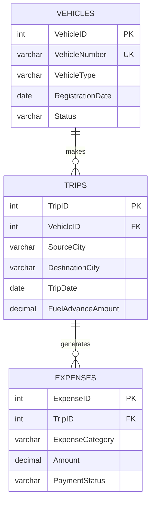

# Entity Relationship Diagram

```mermaid
erDiagram
    VEHICLES ||--o{ TRIPS : "makes"
    TRIPS ||--o{ EXPENSES : "generates"

    VEHICLES {
        int VehicleID PK
        varchar VehicleNumber UK
        varchar VehicleType
        date RegistrationDate
        varchar Status
    }

    TRIPS {
        int TripID PK
        int VehicleID FK
        varchar SourceCity
        varchar DestinationCity
        date TripDate
        decimal FuelAdvanceAmount
    }

    EXPENSES {
        int ExpenseID PK
        int TripID FK
        varchar ExpenseCategory
        decimal Amount
        varchar PaymentStatus
    }
```

One vehicle → many trips. One trip → many expenses. Straightforward
one-to-many chain, no many-to-many relationships in this schema.
